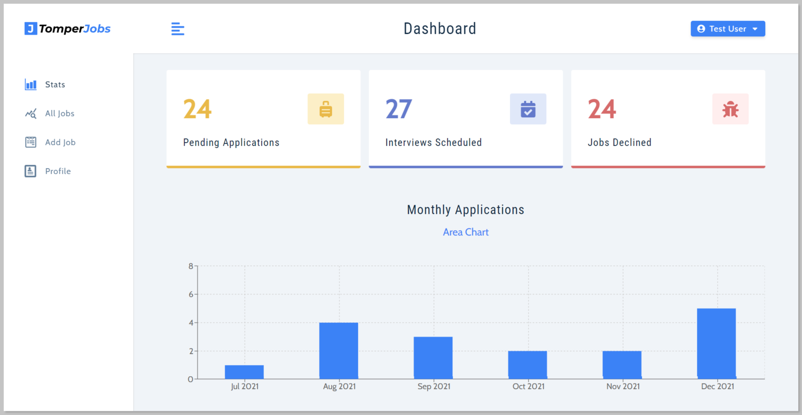

<p align='center'>

</p>
<p align='center'>
<b>Job Application tracking application build with <a href='https://reactjs.org/' target='_blank'>React.js</a> and <a href='https://redux-toolkit.js.org/' target='_blank'>Redux-Toolkit</a></b>
</p>
<p align='center'>
<a href='https://tomper-jobs.netlify.app/' target='_blank'>https://tomper-jobs.netlify.app</a>
</p>

---

<p align='center'>
This is the frontend Tomper-Jobs, build with <a href='https://reactjs.org/' target='_blank'>React.js</a> and <a href='https://redux-toolkit.js.org/' target='_blank'>Redux-Toolkit</a>, and hosted with <a href='https://www.netlify.com/' target='_blank'>Netlify</a>
</p>
<p align='center'>

</p>

#### 🧾 Description

TopperJobs is a job application tracking application that keeps track of the jobs you've applied for.

#### ✨ Features

- [x] User authentication.
- [x] Added, update or remove applications.
- [x] Search jobs by its `name`, `type`, `status` etc.
- [x] Responsive for all screen sizes.

#### ⚙ Tools and Technologies used

1. [React.js](https://reactjs.org/)
2. [React-icons](https://react-icons.github.io/react-icons/)
3. [Styled-Components](https://react-icons.github.io/react-icons/)
4. [Redux-Toolkit](https://redux-toolkit.js.org/)

#### 🛠 Installation and setup

1. Clone the repo to your local machine.
2. Install the required dependency using :

   ```javascript
   npm install
   ```

3. Start the react development server using:

   ```javascript
   npm start
   ```

#### 🏎 Creating production built

1. Create a production build react app using the command :

   ```javascript
   npm run build
   ```

<br>
<br>
<br>

<p align='center'>
(If you liked the project, give it star 😃)
</p>
